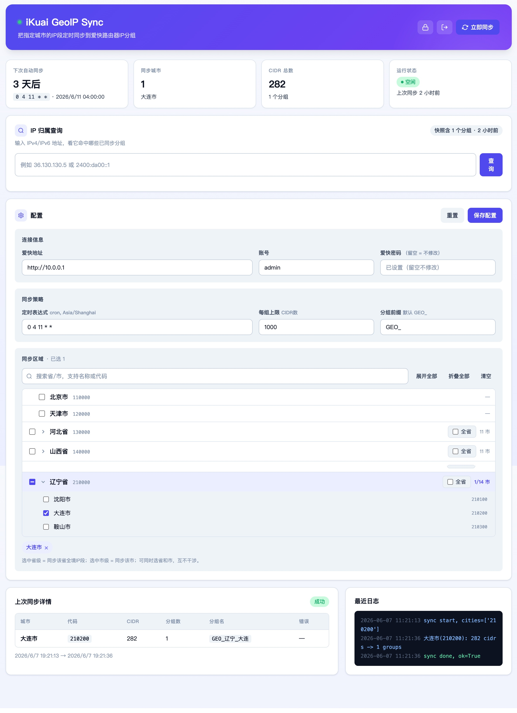

# iKuai GeoIP Sync

> ## ⚠️ 本仓库已停止更新，请改用 [ikuai-toolbox](https://github.com/millerweng/ikuai-toolbox)
>
> ```bash
> git clone https://github.com/millerweng/ikuai-toolbox.git
> ```
>
> ### 为什么要换
>
> **1. 这里的代码在爱快 4.0 上跑不了。**
> 本仓库用的是老的 `ipgroup` 接口。爱快 4.0 把路由对象换成了 `route_object_ip`，
> 老接口直接返回 `Access denied`，同步会全部失败。
> 新仓库登录后自动识别固件版本，4.0 和 3.x 都能用。
>
> **2. 新功能只在新仓库。** 本仓库只能同步城市 IP 段，新仓库还能：
>
> - 把 GFW 域名列表写进爱快的**域名分组**（gfwlist / v2ray-rules-dat 三个来源可选）
> - 查一个域名在不在已同步的分组里，支持子域名匹配
> - 自己加域名，和 GFW 列表合并后一起写入。粘网址、带端口、中文域名都会自动修正
> - 分组名自动适配爱快的 15 字符上限，非法字符自动去掉
>   （本仓库遇到「省直辖县(\*)」这类区域会直接同步失败）
> - 每个分组第一条挂同步时间的备注，在爱快后台一眼能看到更新时间
>
> **3. 名字不准了。** 现在做的事早就不只是同步 GeoIP，所以改名成 `ikuai-toolbox`。
>
> ### 怎么迁移
>
> 配置文件格式没变。把 `data/` 目录整个复制到新项目下面，`docker compose up -d --build` 就行。
> 只有一处要注意：域名分组的默认名从 `GFW` 改成了 `GFW_`（分组变成 `GFW_1`、`GFW_2`…），
> 新版本会自动清理掉老命名的分组，不用手动删。



把中国指定城市的 IP 段定时同步到爱快路由器的 IP 分组（IP/MAC 分组管理）。

## 功能

- 从 [metowolf/iplist](https://github.com/metowolf/iplist) 抓取按行政区划代码组织的城市 IP 段
- 每月自动同步一次（cron 可配），也可手动触发
- 单组超过 N 条自动拆成 `大连`、`大连2`、`大连3`...
- Web UI：状态监控、立即同步、配置管理、IP 归属查询、实时日志
- 首次访问强制设置管理密码，后续使用 session cookie 鉴权

## 部署（Docker Compose）

```bash
cp .env.example .env   # 按需修改端口等，无需填写任何密码
docker compose up -d --build
```

浏览器打开 `http://<host>:8765`，**首次访问会引导你设置管理密码**。

登录后在配置页面填写爱快路由器地址、账号、密码，以及需要同步的城市。

## 配置说明

所有配置均可在 Web UI 中修改，无需重启容器。`.env` 仅用于设置宿主机端口等容器启动参数，**不需要填写任何密码**。

| 配置项 | 说明 | 默认值 |
|--------|------|--------|
| 爱快地址 | 路由器 Web 控制台地址 | `http://10.0.0.1` |
| 账号 / 密码 | 爱快登录凭据（Web UI 中设置，不写入文件系统明文） | — |
| 城市代码 | 见下方城市代码说明 | 空（首次需配置） |
| 每组上限 | 单个 IP 分组最大 CIDR 条数，超出自动拆分 | `1000` |
| 分组前缀 | IP 分组名前缀，留空则直接用城市名 | `GEO_` |
| 定时表达式 | cron（Asia/Shanghai），控制自动同步周期 | `0 4 11 * *` |

## 数据安全

- 管理密码以 bcrypt 哈希存储于 `data/auth.json`，**不存明文**
- 爱快密码存于 `data/config.json`（仅容器内可读，不纳入 git）
- `data/` 目录整体已加入 `.gitignore`，不会泄漏到代码仓库

## 城市代码

见 [metowolf/iplist cncity.md](https://github.com/metowolf/iplist/blob/master/docs/cncity.md)

常用城市代码：大连 `210200`、沈阳 `210100`、北京 `110100`、上海 `310100`、广州 `440100`、深圳 `440300`、杭州 `330100`
